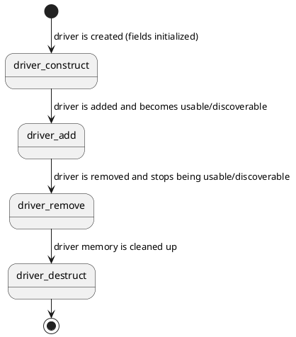
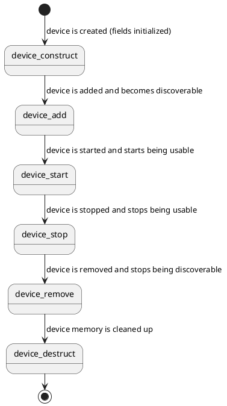

# Drivers

## Driver definition and lifecycle

Drivers are defined by `struct Driver` in `tactility/driver.h`:

```c
struct Driver {
    const char* name;
    const char**compatible;
    error_t (*start_device)(struct Device* dev);
    error_t (*stop_device)(struct Device* dev);
    const void* api;
    const struct DeviceType* device_type;
    const struct Module* owner;
    struct DriverPrivate* driver_private;
};
```

When making a driver, all fields most be set. For example:

```c
Driver esp32_i2c_driver = {
    .name = "esp32_i2c",
    .compatible = (const char*[]) { "espressif,esp32-i2c", nullptr },
    .start_device = start,
    .stop_device = stop,
    .api = (void*)&esp32_i2c_api,
    .device_type = &I2C_CONTROLLER_TYPE,
    .owner = &platform_module,
    .driver_private = nullptr
};
```

`name` makes is useful for logging or debugging.

`compatible` is used to match a driver to a device.

`start_device` and `stop_device` binds or unbinds a device to/from the driver.

`api` is an optional field that can be used internally by the driver.

`device_type` is used to find drivers of the same type (e.g. to find all I2C controllers or all Grove ports)

`owner` is the optional owner of the driver. If a driver doesn't have an owner, it can not be removed after adding it.

The lifecycle is as follows:



## Device

A device generally relates to a specific piece of hardware.
There can also more abstract instances of devices that help facilitate other devices.

```c
/** Represents a piece of hardware */
struct Device {
    const char* name;
    const void* config;
    struct Device* parent;
    struct { /* ... */ } internal;
}
```

A device has a name for debugging/logging purposes.
It has an optional `config`.

For example:

```c
static struct Device i2c_internal = {
	.name = "i2c_internal",
	.config = &i2c_internal_config,
	.parent = &root,
};
```

Devices are part of a devicetree. This tree starts with a root node and all devices are attached to it.
This means that all devices have a parent, except for the root node itself. More on that later in the Devicetree section of this document.

So its lifecycle is as follows:



The code could look like this:

```c
// Find the driver
struct Driver* driver = driver_find_compatible("espressif,esp32-i2c");

check(device_construct(&i2c_internal) == ERROR_NONE);
device_set_driver(&i2c_internal, driver);
check(device_add(&i2c_internal) == ERROR_NONE);
check(device_start(&i2c_internal) == ERROR_NONE);

// The device is now usable

check(device_stop(&i2c_internal) == ERROR_NONE);
check(device_remove(&i2c_internal) == ERROR_NONE);
check(device_denstruct(&i2c_internal) == ERROR_NONE);
```


## Module

A module is a collection of drivers or other functionality that can be loaded and unloaded at runtime.

```c
struct Module {
    const char* name;
    error_t (*start)(void);
    error_t (*stop)(void);
    struct { /* ... */ } internal;
};
```

There are many types of modules:
- Platform modules: Found in `Platforms/`. These contain platform drivers and optionally initialization code for the platform.
- Device modules: Found in `Devices/`. These contain device-specific drivers and optionally initialization code for a device.
- Other modules: Modules that contain specific features are found in `Modules/` (e.g. LVGL)

For example:

```c
struct Module platform_module = {
    .name = "platform-esp32",
    .start = start, // register ESP32 drivers
    .stop = stop // deregister ESP32 drivers
};
```

A module is tracked by a `ModuleParent`:

```c
struct ModuleParent {
    const char* name;
    struct ModuleParentPrivate* module_parent_private;
};
```

Example:

```c
// Construct parent
check(module_parent_construct(&parent) == ERROR_NONE);

// Set parent and start module
check(module_set_parent(&hal_device_module, &parent) == ERROR_NONE);
check(module_start(&hal_device_module) == ERROR_NONE);

// The module is now active

// Stop the module
check(module_stop(&hal_device_module) == ERROR_NONE);
```

## Devicetree

The devicetree defines a set of `struct Device` instances based on a `.dts` file and related `.yaml` bindings that are specified by the drivers:

```c
#include <bindings/tlora_pager.h>
#include <tactility/bindings/esp32_gpio.h>
#include <tactility/bindings/esp32_i2c.h>

/ {
	compatible = "lilygo,tlora-pager";
	model = "LilyGO T-Lora Pager";

	gpio0 {
		compatible = "espressif,esp32-gpio";
		gpio-count = <49>;
	};

	i2c0 {
		compatible = "espressif,esp32-i2c";
		port = <I2C_NUM_0>;
		clock-frequency = <100000>;
		pin-sda = <3>;
		pin-scl = <2>;
	};
};
```

The `compatible` field of each device specifies which driver should be bound.

This is matched with the name that the driver specifies in its YAML file:

```yaml
description: ESP32 GPIO Controller

compatible: "espressif,esp32-gpio"

# Inherit properties
include: ["gpio-controller.yaml"]
```

And `gpio-controller.yaml`:

```yaml
properties:
  gpio-count:
    type: int
    required: true
    description: |
        The number of available GPIOs.
```

These YAML files are used for parsing the devicetree's `.dts` file.

The driver implementation also specifies `compatible`:

```c
Driver esp32_gpio_driver = {
    /* ... */
    .compatible = (const char*[]) { "espressif,esp32-gpio", nullptr },
    /* ... */
};
```

Here, `compatible` is used for finding the right driver when initializing the device.

Devicetrees can be found in the device subprojects in `Devices/`.
